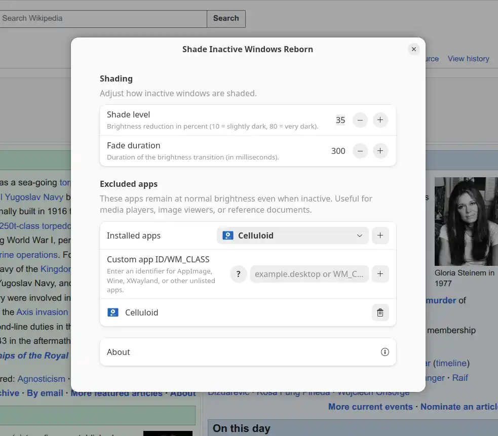

# Shade Inactive Windows Reborn

(Tiếng Việt bên dưới)

A modernized GNOME Shell extension that dims/shades inactive windows to help you focus on your active workspace.

## Screenshot



## Features & Improvements

* **Modern Codebase**: Completely rewritten for modern GNOME Shell versions (45 and above).
* **Customizable Shading & Transitions**: Adjust the dimming/shade level of inactive windows and transition animation duration.
* **App Exclusion**: Easily exempt specific applications from being shaded.

## Installation

**[Get it on GNOME Extensions](https://extensions.gnome.org/extension/10871/shade-inactive-windows-reborn/)**

Install via Extension Manager (Recommended)

1. Open **Extension Manager**. If you don't have it installed yet:
   
   ```bash
   flatpak install flathub com.mattjakeman.ExtensionManager
   ```
   
2. Switch to the **Browse** tab.
3. Search for **Shade Inactive Windows Reborn**.
4. Click **Install**.

## Acknowledgements & Credits

This project is completely rewritten based on the concept of Shade Inactive Windows, originally created by [hepaajan](https://github.com/hepaajan/shade-inactive-windows).

## License

GNU General Public License v3.0 or later.

---
## Tiếng Việt

Tiện ích mở rộng GNOME Shell giúp làm mờ/làm tối các cửa sổ không hoạt động, giúp bạn tập trung tối đa vào không gian làm việc hiện tại.

## Ảnh chụp màn hình


## Tính năng & Cải tiến

Viết lại mã nguồn: viết lại theo chuẩn GJS mới cho các phiên bản GNOME Shell đời mới (từ 45 trở lên).

Tùy chỉnh độ tối & hiệu ứng làm tối: cho phép điều chỉnh mức độ hiệu ứng làm tối và thời gian chạy hiệu ứng.

Loại trừ ứng dụng: cho phép chỉ định các app ngoại lệ không bị làm tối, hữu ích cho các app như xem ảnh, xem tài liệu,...

Cài đặt

**[Tải trên trang GNOME Extensions](https://extensions.gnome.org/extension/10871/shade-inactive-windows-reborn/)**

Cài đặt thông qua Extension Manager (Khuyên dùng)

1. Mở ứng dụng Extension Manager. Nếu chưa cài đặt, bạn có thể cài bằng lệnh:

   ```bash
   flatpak install flathub com.mattjakeman.ExtensionManager
   ```

2. Chuyển sang tab Browse.
3. Tìm kiếm Shade Inactive Windows Reborn.
4. Nhấn Install.

## Lời cảm ơn & Ghi nhận

Dự án này được viết lại dựa trên ý tưởng từ extension gốc Shade Inactive Windows, ban đầu được tạo bởi hepaajan.

## Giấy phép

Giấy phép Công cộng GNU phiên bản 3.0 (GPL-3.0) hoặc mới hơn.
